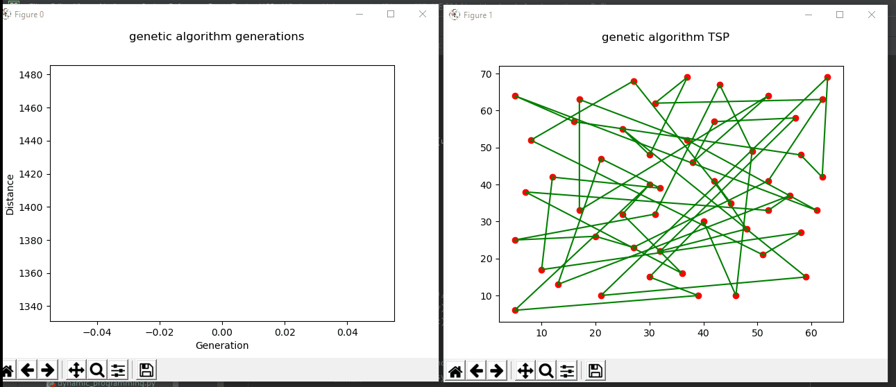
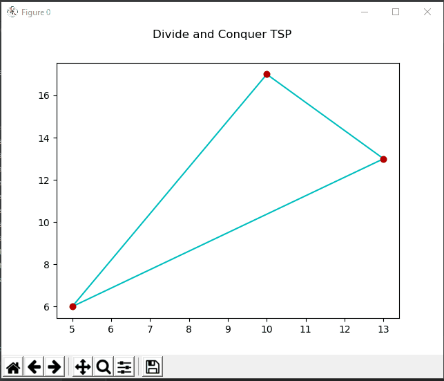
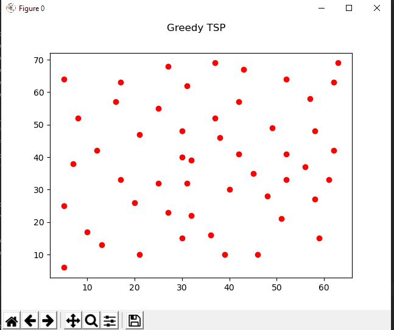
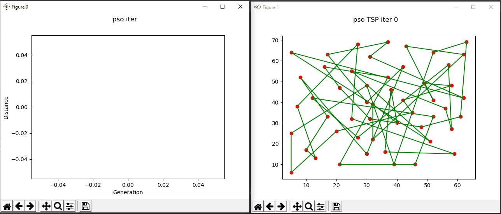

Solving the Travelling Salesman Problem in Python 
===================
## Implemented techniques
* __Genetic Algorithm__
* __Simulated Annealing__
* __PSO: Particle Swarm Optimization__
* __Divide and conquer__
* __Dynamic Programming__
* __Greedy__
* __Brute Force__

When the solution is found it is plotted using Matplotlib and for some algorithms you can see the intermediate results  

### Example visualizations
The following visualizations are all applied on the [EIL51 dataset](http://elib.zib.de/pub/mp-testdata/tsp/tsplib/tsp/eil101.tsp)
available through the [TSP online library](http://elib.zib.de/pub/mp-testdata/tsp/tsplib/tsplib.html)
#### Genetic Algorithm

#### Divide and Conquer

#### Greedy

#### PSO: Particle Swarm Optimization

